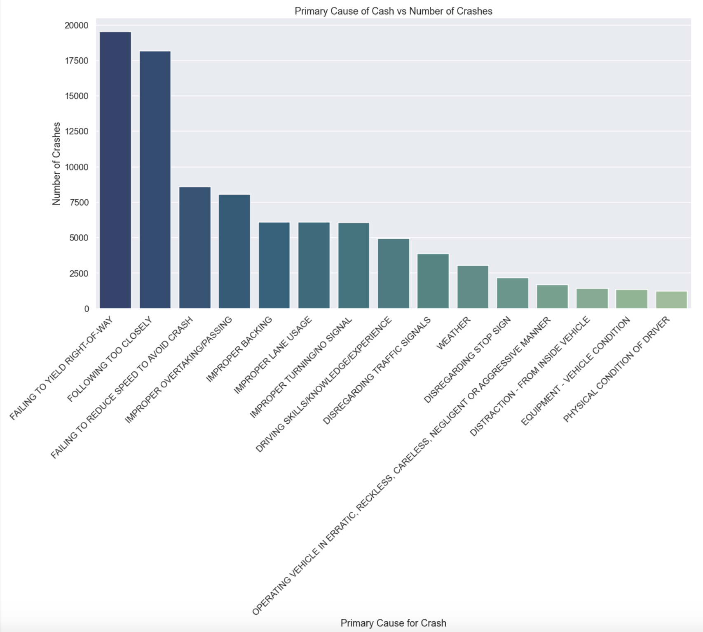
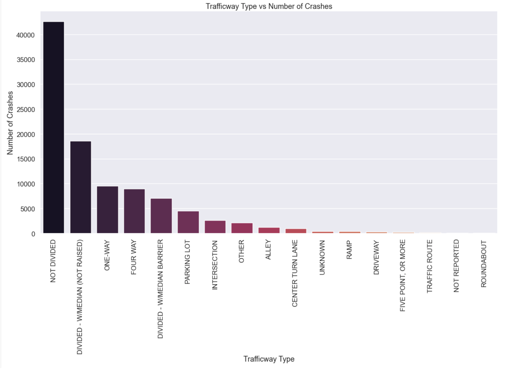
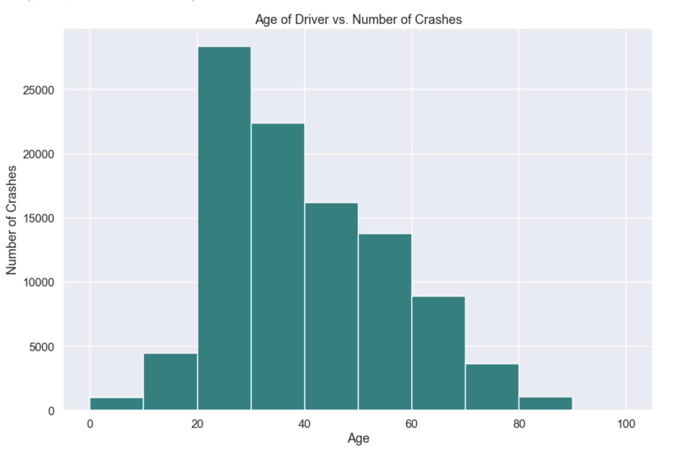
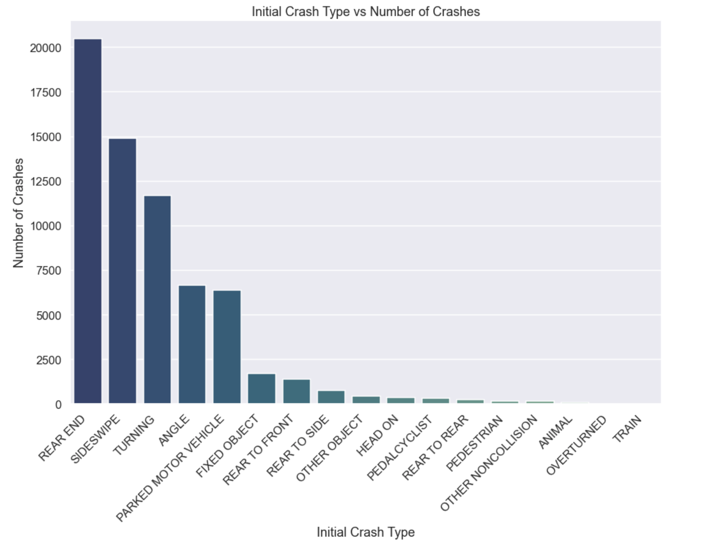
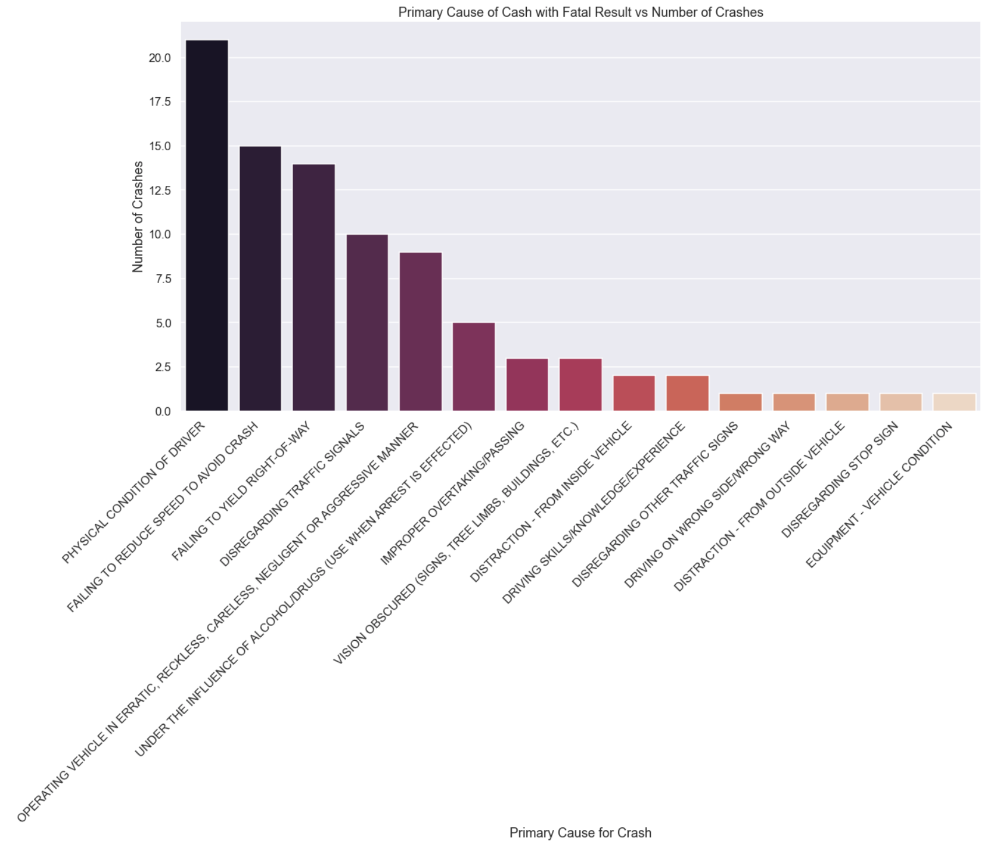
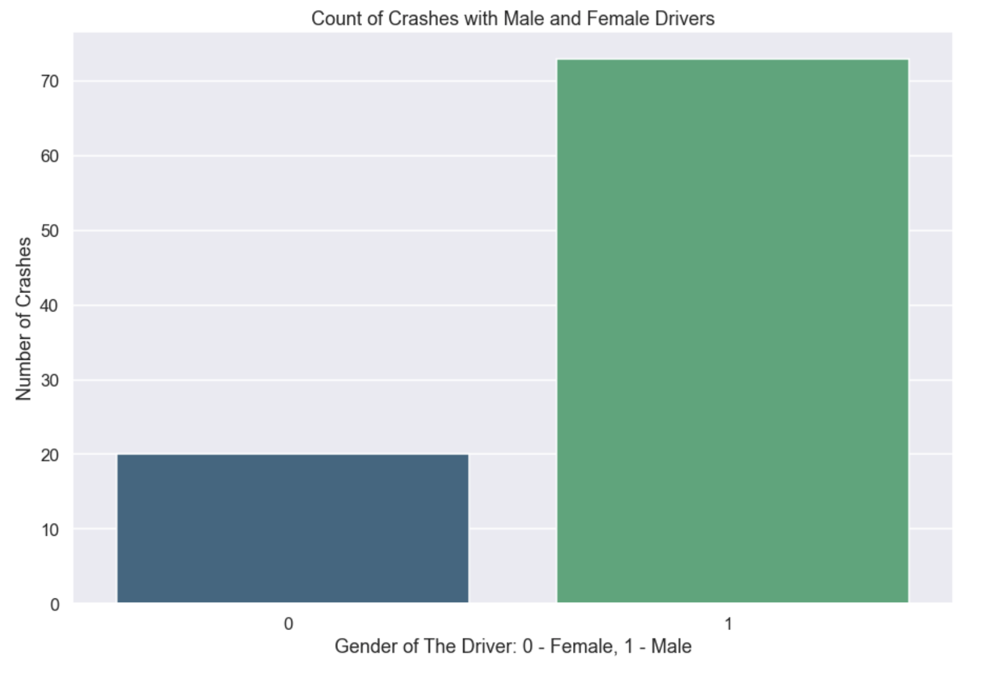
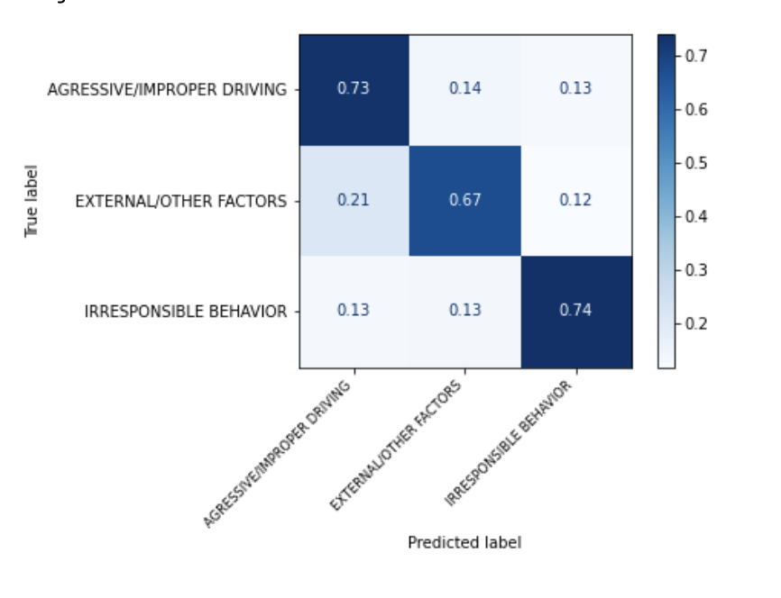

# Classify the Primary Causes for Car Crashes in Chicago

### Quick Links

1. [Data Preparation Notebook](notebooks/Data_Cleaning.ipynb)
2. [Exploratory Analysis](notebooks/EDA.ipynb)
3. [Modeling Notebook](notebooks/Modeling.ipynb)
4. [Presentation Slides](ChicagoCar.pdf)

My purpose for this project was to build a predictive model that would analyze the primary causes of car crashes. Being able to predict the main cause for an incident might help the city to effectively act against it. If we know the cause for an incident, a city can then plan appropriately as to what measures should be taken to prevent them from happening again. In this project, I will be looking at car crash data from the city of Chicago in order to build a predictive model for their causes as well as identify a number of trends from the incidents.

# Data 

The Traffic Crashes and Traffic Crashes - People data comes from the Chicago Data Portal, an open data source maintained by the city of Chicago. The datasets contain all traffic crashes reports going back to 2017. Each crash incident has a unique crash record ID and report number associated with it, which allows for cross-referencing on the dashboards provided for the datasets.

The Crashes dataset contains a number of details related to the incident, such as location/time information, conditions of the road and traffic safety device functionality. The most important detail available is the primary contributory cause for the crash. 

The People dataset contains a details associated with people involvesd in crash, like drivers, passangers and pedastrians. The data provider is mostly related to injuries of the person, personal information and after crash acrtivities. 

The links to the datasets:

Crashes Dataset: https://data.cityofchicago.org/Transportation/Traffic-Crashes-Crashes/85ca-t3if

People Dataset: https://data.cityofchicago.org/Transportation/Traffic-Crashes-People/u6pd-qa9d

# Data Exploration and Analysis

For my analysis, I've decided to focus on crashes that have taken place between January 2019 to December 2020. After that I was left with roughly 465 000 records. Before starting to build a model I've cleaned the datasets from unnecessary columns and observations - those that were missing vast amount of information I can work with and unrelated to the analysis.

Before proceeding to Exploratory Analysis I've merged Crashes Dataset and People Dataset into one and stored the dataframe as new file. 

The Exploration of the dat was performed in separate notebook named: EDA. 

For the purpose of this project I've first looked at the data as a whole and performed some analysis: 

- Frequency of crashes occured at the specific time, day of week and month. 
- Primary causes of the crash occured the most in the data
- Age of the driver

### Time, Day of Week and Month 

In order to better understand when the incidents occured the most, I've performed frequency table for when the crash took place. Knowing this contributory cause of the crashes will help the city to better understand when to be causious and prepared the most to be able to prevent the incidents. 

As the graphs show, most of the incidents take place during afternoon (around 3 PM). Most appropriate reason that would explain the situation is traffic. Also, Saturday have the highest number of incidents. And mojority of crashes take place during January and December, assuming that it's due the weather condition.

The graph above shows the number of crashes with different injury categories at each hour. The peak hours for the crashes with injury are from 1 PM to 5 PM. 

### Primary Cause

I also look at what was the leading primary cause for these crashes. As we are trying to prevent traffic crashes from occurring, identifying the leading causes will allow the city to take appropriate counter measures. 

Most of the causes of the crashes are related to the driver's action, and the leading causes are failing to yield and following too closely.

### Trafficway Type

The graph above shows that for most of the crashes the trafficway was not divided.

### Age of the Driver

I've assumed that age of the driver could be potential contriburory cause of his action and looked into age range of the crashes.

Most of the incidents are related wit hthe drivers of age around 20 and higher, starting from 40 the drivers tend to get in less car accidents. I assume that is related to the experience.

## Fatal Injury and No - Injury Crashes

After exploring the data as a whole, I've decided to separate it into two categories: Crashes with Fatal Injuries and Crashes without Injuries. And perfomed some basic visual explorations.

### Crashes with No Injury

Based in the analysis, it was observed that most of the time the weather conditions were good, the road surface was clean and with no defects, the driver's vision was not obscured and his physical condition was normal.

The explration of the initial crash type showed that most of the crashes happed at rear end. 

### Crashes with Fatal Injury

Crashes with fatal injury were analyzed the same way as crashes without injury. The results of analysis showed that mostly during the crash the weather conditions were good, the road surface was clean and with no defects, the driver's vision was not obscured and his physical condition was normal. 

As for the primary cause of the incidents fatal injuries mostly it is driver's physiscal condition and failing to reduce the speed.

It was noticable that most of the crashes resulted in fatal injury were related to male drivers.

### Primary Contributory Cause Categories

Since the project purpose s to build a multiclass model, I've sorted out the target variable Primary Contributory Cause and narrowed it down to three categories:

- AGRESSIVE/IMPROPER DRIVING
- IRRESPONSIBLE BEHAVIOR
- EXTERNAL/OTHER FACTORS      

The new dataframe with changes was stored as new file.

## Modeling

Multiclass classification models were used in order to try to classify these incidents. Models such as Logistic Regression, K-Nearest Neighbors and Decision Trees were among those used. The model that had the best performance was Logistic Regression with all features. It had an accuracy of roughly 73%. The model was able to predict true values with best coefficients. 

## Conclusion

From my analysis, I believe that the promotion of slower and less aggressive driving will result in fewer major incidents occurring. In addition, taking necessary actions against the traffic situation will help avoid vast majority of crashes. It would be appropriate to make sure new drivers have enough experience, since most of the drivers are around 20-30 years old. 

